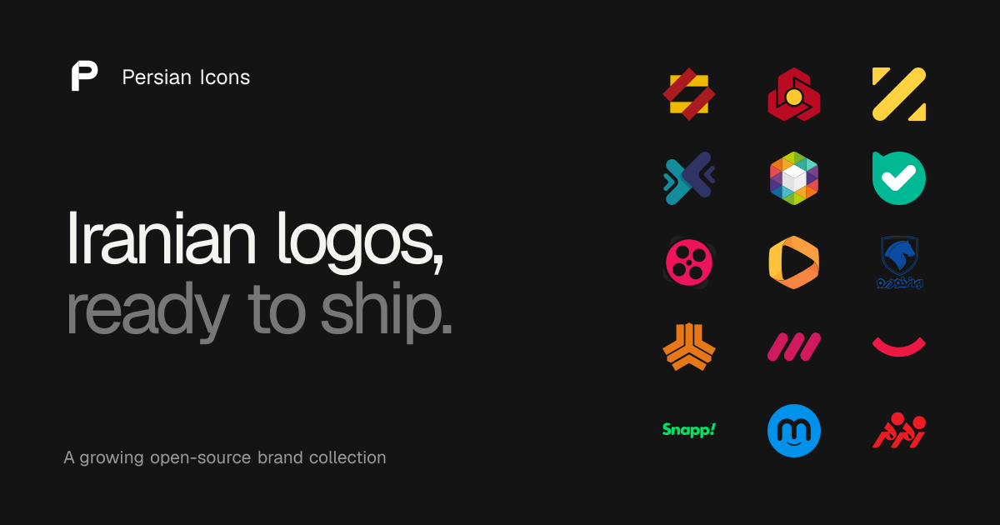

<p align="center">
  <a href="https://icons.persian-labs.ir">
    
  </a>
</p>

<h1 align="center">Persian Icons</h1>

<p align="center">
  A growing, typed, open-source collection of Iranian bank, payment gateway, and brand logos for React and Vue.
</p>

<p align="center">
  <a href="https://www.npmjs.com/package/@persianlabs/icons"></a>
  <a href="https://www.npmjs.com/package/@persianlabs/icons"></a>
  <a href="https://github.com/persianlabs/icons/blob/main/LICENSE"></a>
  <a href="https://github.com/persianlabs/icons/stargazers"></a>
</p>

<p align="center">
  <a href="https://icons.persian-labs.ir"><b>icons.persian-labs.ir</b></a>
</p>

<p align="center">
  <a href="https://github.com/persianlabs/icons">GitHub</a>
  ·
  <a href="https://www.npmjs.com/package/@persianlabs/icons">npm</a>
  ·
  <a href="https://icons.persian-labs.ir/llms.txt">llms.txt</a>
</p>

<p align="center">
  <a href="https://icons.persian-labs.ir">
    
  </a>
</p>

## Install

```bash
npm install @persianlabs/icons
```

Or use `pnpm add @persianlabs/icons` or `bun add @persianlabs/icons`.

## React

```tsx
import { BankMelliColor, BankMelliMono } from "@persianlabs/icons/react"

export function Example() {
  return (
    <>
      <BankMelliColor width={48} title="Bank Melli" />
      <BankMelliMono className="text-black dark:text-white" width={48} title="Bank Melli" />
    </>
  )
}
```

## Vue

```vue
<script setup lang="ts">
import { BankMelliColor, BankMelliMono } from "@persianlabs/icons/vue"
</script>

<template>
  <BankMelliColor width="48" aria-label="Bank Melli" />
  <BankMelliMono class="mono-logo" width="48" aria-label="Bank Melli" />
</template>

<style>
.mono-logo {
  color: currentColor;
}
</style>
```

## Monochrome logos

Monochrome components use `currentColor`, so they naturally follow the surrounding text color—black in a light theme and white in a dark theme when those are your foreground colors.

## Repository

- `packages/icons` — npm package with generated React and Vue components
- `apps/docs` — Next.js 16.3 documentation and icon playground
- `packages/ui` — shared shadcn/ui components and styles
- `packages/icons/assets` — versioned source SVG artwork, organized by category and variant

```bash
bun install
bun run dev
```

Before opening a pull request:

```bash
bun run format
bun run typecheck
bun run lint
bun run build
```

## License and credit

Released under the MIT License.

Built for React and Vue by [Persian Labs](https://github.com/persianlabs).

Source credit: [zegond](https://github.com/zegond) on GitHub, whose [logos-per-banks](https://github.com/zegond/logos-per-banks) collection made this possible.

Design credit: [Figma community file](https://www.figma.com/design/WffGtbvZwICTbMxrWFRoZF/400-Persian-Brands--v1.2--Community-?node-id=0-1&p=f&t=9ujkah3t5mrJpL6Y-0) by [shahabebadi](https://www.figma.com/@shahabebadi), [13masa79](https://www.figma.com/@13masa79), [mahdi7715](https://www.figma.com/@mahdi7715), and [behzad521](https://www.figma.com/@behzad521).
